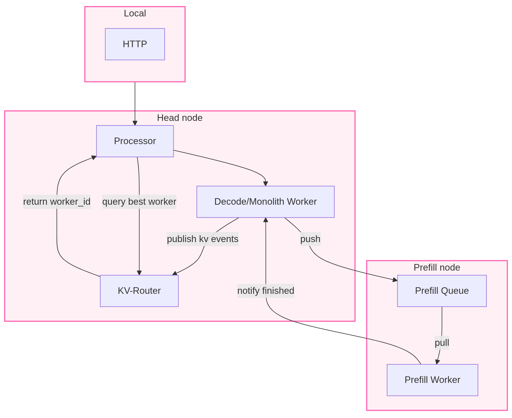
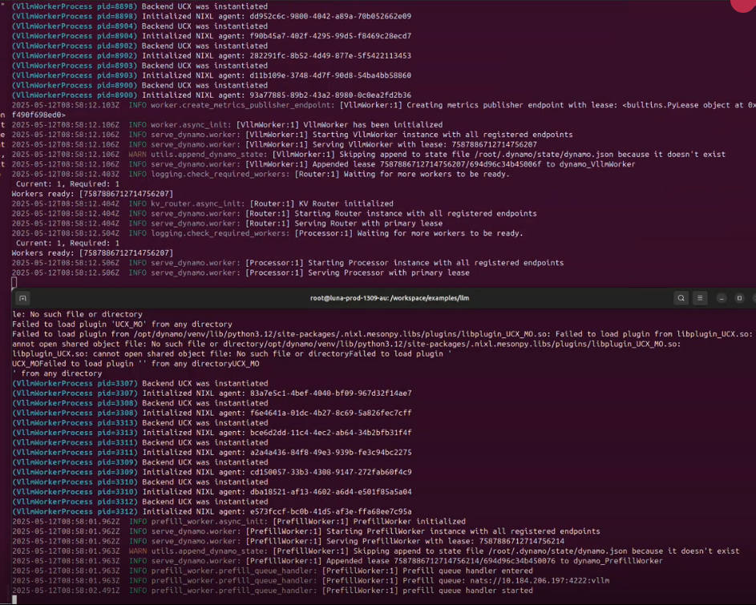
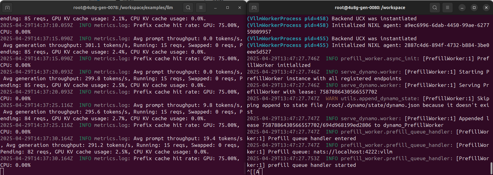

# Node-size model multi-node serving

In this page, we  explain how to do serving multiple nodes.

The instructions extend the instructions from [the multi-node demo](https://github.com/ai-dynamo/dynamo/blob/main/examples/llm/multinode-examples.md).




We are serving two different models in this document, which constitutes two different demos:

1) [nvidia/Llama-3.1-405B-Instruct-FP8](#nvidiallama-31-405b-instruct-fp8)
2) [nvidia/Llama-3_3-Nemotron-Super-49B-v1](#nvidiallama-3_3-nemotron-super-49b-v1)

In this table, we are including the requirements for the demos:

| Model Name                                 | Nodes | GPUs per Node | GPU Type | Precision Format | HF link |
|---------------------------------------------|:-----:|:-------------:|:--------:|:----------------:|:----------------:|
| nvidia/Llama-3_3-Nemotron-Super-49B-v1      |   2   |      8        |  A100    |      FP16        | [link](https://huggingface.co/nvidia/Llama-3_3-Nemotron-Super-49B-v1) |
| nvidia/Llama-3.1-405B-Instruct-FP8          |   2   |      8        |  H100    |      FP8         | [link](https://huggingface.co/nvidia/Llama-3.1-405B-Instruct-FP8) |

The nvidia/Llama-3.1-405B-Instruct-FP8 is used in the [multi-node example](https://github.com/ai-dynamo/dynamo/blob/main/examples/llm/multinode-examples.md) in the Dynamo product repository, and relies on this [configuration file](https://github.com/ai-dynamo/dynamo/blob/main/examples/llm/configs/multinode-405b.yaml). This is a large model, but given that it was quantized and it can still fit on a node. To run this example, you must use GPU from the Hopper architecture at minimum. Ampere architecture does not support FP8.

nvidia/Llama-3_3-Nemotron-Super-49B-v1 demos can be run with GPU starting from the Ampere architecture. For this example, we customized a [configuration file](multinode_llama49b.yaml).

**Note**: In this document, we are using just two nodes, however the examples can be easily extended to more nodes. To add more nodes, you repeat the [pre-fill stage](#on-the-other-nodes-pre-fill-node) on each pre-fill node.

## nvidia/Llama-3.1-405B-Instruct-FP8

Log on 2 nodes of 8 x H100 on your cluster. Once you are all logged on ALL nodes, you can proceed.

### On the head node

Obtain the IP of the head node <head_node_ip> :  

```bash
ip addr | grep -Po '(?!(inet 127.\d.\d.1))(inet \K(\d{1,3}\.){3}\d{1,3})'   
```

Take the IP address that is not the localhost (meaning not 192.*). This will be used to set up the  NATS_SERVER and ETCD_ENDPOINTS on the other node(s).

Then, we set up the NATS and ETCD servers on the head node.

```bash
docker compose -f deploy/metrics/docker-compose.yml up -d 
```

We build the container.

```bash
./container/build.sh         

./container/run.sh -it  
```

Once inside the container, run:

```bash
cd examples/llm 
dynamo serve graphs.agg_router:Frontend -f ./configs/multinode-405b.yaml 
```

The service will be up and waiting.

### On the other node(s) (pre-fill node)

**Note**: This step should be repeated on all pre-fill nodes you want to use.

We build and run the container.

```bash
./container/build.sh         

./container/run.sh -it  
```

Once inside the container, we indicate where is the head-node and run:

```bash
export NATS_SERVER="nats://<head_node_ip>:4222" 

export ETCD_ENDPOINTS="http://<head_node_ip>:2379" 
```

```bash
cd examples/llm
dynamo serve components.prefill_worker:PrefillWorker -f ./configs/multinode-405b.yaml 
```

You should expect the view as the image below once all services are up.Top is the head node and bottom is the prefill node.


### On a local terminal

#### Single request

```bash
curl <head_node_ip>:8000/v1/chat/completions  -o output.txt -H "Content-Type: application/json"   -H "Accept: text/event-stream"   -d '{ 

    "model": "nvidia/Llama-3.1-405B-Instruct-FP8", 

    "messages": [ 

      { 

        "role": "user", 

        "content": "write a very long and boring bedtime story about an unicorn that rhymes"

      } 

    ], 

    "stream": true, 

    "max_tokens": 7500 

  }'  

```

The curl command is using streaming, so we will receive the output token one by one.  

#### Multiple requests (let´s stress Dynamo)

One request is not enough to stress out Dynamo on two nodes, so we will send numerous requests in parallel, in our example 100 at once.

```bash
seq 1 100 | xargs -n1 -P100 curl <head_node_ip>:8000/v1/chat/completions  -o output.txt -H "Content-Type: application/json"   -H "Accept: text/event-stream"   -d '{ 

   "model": "nvidia/Llama-3.1-405B-Instruct-FP8", 

   "messages": [ 

     { 

       "role": "user", 

       "content": "write a very long and boring bedtime story about an unicorn that rhymes" 

     } 

   ], 

   "stream": true, 

   "max_tokens": 7500

 }' 

```

During the inference, you can monitor numerous metrics such as average throughput, number of requests being processed, GPU KV cache usage, prefix cache hit rate, as shown in the image below.
The numerous requests being processed as well as the ones waiting/pending. In that case, it seems, it can only handle 15 requests at once.
However, the GPU KV cache usage remains very low at 2.5%, however Dynamo reuses the KV cache intensively giving the high prefix cache hit rate, this is expected as we are requested the same request 100 times. It reuses the KV cache over and over again to generate the output for each request.




## nvidia/Llama-3_3-Nemotron-Super-49B-v1

The same steps as with Llama-3.1-405B-Instruct-FP8 can be followed. The three elements that need to be changed are the configuration file, the name of model and  `max_tokens` number in the request command.
Instead of using multinode-405b.yaml,  the config file [multinode_llama49b.yaml] (multinode_llama49b.yaml) needs to be used.
`max_tokens` depends of the context length of the model and the size of the input prompt and should be adapted. For nvidia/Llama-3_3-Nemotron-Super-49B-v1, the context length is 2048 and given the different parameters should respect this: `max_tokens + input_prompt_length < context_length`.

```bash
curl <head_node_ip>:8000/v1/chat/completions   -H "Content-Type: application/json"   -d '{
    "model": "nvidia/Llama-3_3-Nemotron-Super-49B-v1",
    "messages": [
    {
        "role": "user",
        "content": "In the heart of Eldoria, an ancient land of boundless magic and mysterious creatures, lies the long-forgotten city of Aeloria. Once a beacon of knowledge and power, Aeloria was buried beneath the shifting sands of time, lost to the world for centuries. You are an intrepid explorer, known for your unparalleled curiosity and courage, who has stumbled upon an ancient map hinting at ests that Aeloria holds a secret so profound that it has the potential to reshape the very fabric of reality. Your journey will take you through treacherous deserts, enchanted forests, and across perilous mountain ranges. Your Task: Character Background: Develop a detailed background for your character. Describe their motivations for seeking out Aeloria, their skills and weaknesses, and any personal connections to the ancient city or its legends. Are they driven by a quest for knowledge, a search for lost family clue is hidden."
    }
    ],
    "stream":false,
    "max_tokens": 1500
  }'

```