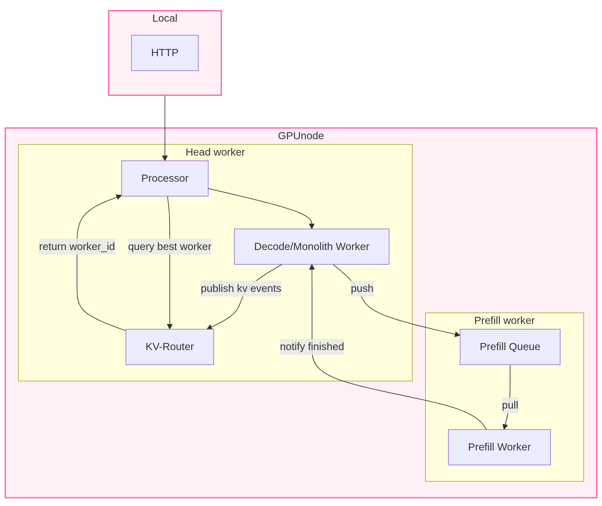
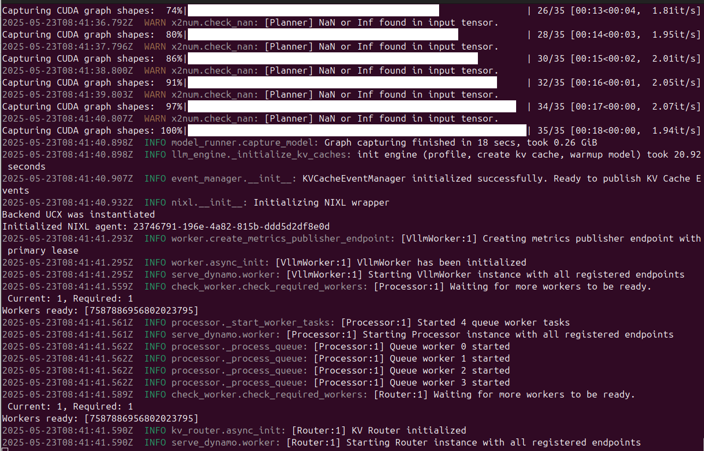

# Node-size model single-node serving

In this page, we  explain how to do serving one node and in particular, we focus on the example of [Disaggregated serving with KV Routing](#disaggregated-serving-with-kv-routing)

Get the IP of the node <remote_ip> :  

```bash
ip addr | grep -Po '(?!(inet 127.\d.\d.1))(inet \K(\d{1,3}\.){3}\d{1,3})'   
```

You should take the IP that is not the localhost (meaning not 192.*)

```bash
docker compose -f deploy/metrics/docker-compose.yml up -d 
```

Finally, we build the container.

```bash
./container/build.sh         

./container/run.sh -it  
```

## Disaggregated serving with KV Routing

This example is performing disaggregated serving with KV Routing. Disaggregated serving means that we  separate the compute of the decode and the prefill on different workers. In this example, workers are within the same node, but on different GPUs. The prefill worker will only do prefill, however the other worker (vLLM worker) could be performing both.
Beyond performing disaggregated serving, the routing of the request is based on the KV cache, meaning that the decision to use the prefill worker (or not) is based on the current state of the KV-cache and if the worker had seen similar requests previously.

The flow of the example is described as follows: 

### Configuration with 2 GPU (2 workers with 1 GPU each)

The corresponding configuration file can be found at [disagg_router.yaml](https://github.com/ai-dynamo/dynamo/blob/main/examples/llm/configs/disagg_router.yaml). The model used is DeepSeek-R1-Distill-Llama-8B.

Now, let´s take a deeper look at the configuration file. We did not copy the whole file, but we refer you to the original [file](https://github.com/ai-dynamo/dynamo/blob/main/examples/llm/configs/disagg_router.yaml) for your reference.

```yaml
Common:
  model: deepseek-ai/DeepSeek-R1-Distill-Llama-8B
  block-size: 64
  max-model-len: 16384
  router: kv
  kv-transfer-config: '{"kv_connector":"DynamoNixlConnector"}'

[...]

VllmWorker:
  max-num-batched-tokens: 16384
  remote-prefill: true
  conditional-disagg: true
  max-local-prefill-length: 10
  max-prefill-queue-size: 2
  tensor-parallel-size: 1
  enable-prefix-caching: true
  ServiceArgs:
    workers: 1
    resources:
      gpu: '1'
  common-configs: [model, block-size, max-model-len, router, kv-transfer-config]

PrefillWorker:
  max-num-batched-tokens: 16384
  ServiceArgs:
    workers: 1
    resources:
      gpu: '1'
  common-configs: [model, block-size, max-model-len, kv-transfer-config]

Planner:
  environment: local
  no-operation: true
```

In the Common section, we can see that we added the KV router using:

```yaml
router: kv
kv-transfer-config: '{"kv_connector":"DynamoNixlConnector"}'
```

For each worker, we have assign 1 GPU. In the decode worker (vLLM worker), we also add an argument to activate remote prefilling `remote-prefill: true`.


### Implementation

```bash
cd examples/llm 
dynamo serve graphs.disagg_router:Frontend -f ./configs/disagg_router.yaml
```

You should expect the view as the image below once the service is up.

.

## On a local terminal

### Single request

```bash
curl <remote_ip>:8000/v1/chat/completions   -H "Content-Type: application/json"   -d '{
    "model": "deepseek-ai/DeepSeek-R1-Distill-Llama-8B",
    "messages": [
    {
        "role": "user",
        "content": "In the heart of Eldoria, an ancient land of boundless magic and mysterious creatures, lies the long-forgotten city of Aeloria. Once a beacon of knowledge and power, Aeloria was buried beneath the shifting sands of time, lost to the world for centuries. You are an intrepid explorer, known for your unparalleled curiosity and courage, who has stumbled upon an ancient map hinting at ests that Aeloria holds a secret so profound that it has the potential to reshape the very fabric of reality. Your journey will take you through treacherous deserts, enchanted forests, and across perilous mountain ranges. Your Task: Character Background: Develop a detailed background for your character. Describe their motivations for seeking out Aeloria, their skills and weaknesses, and any personal connections to the ancient city or its legends. Are they driven by a quest for knowledge, a search for lost family clue is hidden."
    }
    ],
    "stream":false,
    "max_tokens": 30
  }'
```

### Multiple requests

In this case, we  send 5 requests in parallel.

```bash
seq 1 5 | xargs -n1 -P5 curl <remote_ip>:8000/v1/chat/completions  -o output.txt -H "Content-Type: application/json"   -H "Accept: text/event-stream"   -d '{ 

   "model": "deepseek-ai/DeepSeek-R1-Distill-Llama-8B", 

   "messages": [ 

     { 

       "role": "user", 

       "content": "In the heart of Eldoria, an ancient land of boundless magic and mysterious creatures, lies the long-forgotten city of Aeloria. Once a beacon of knowledge and power, Aeloria was buried beneath the shifting sands of time, lost to the world for centuries. You are an intrepid explorer, known for your unparalleled curiosity and courage, who has stumbled upon an ancient map hinting at ests that Aeloria holds a secret so profound that it has the potential to reshape the very fabric of reality. Your journey will take you through treacherous deserts, enchanted forests, and across perilous mountain ranges. Your Task: Character Background: Develop a detailed background for your character. Describe their motivations for seeking out Aeloria, their skills and weaknesses, and any personal connections to the ancient city or its legends. Are they driven by a quest for knowledge, a search for lost family clue is hidden." 

     } 

   ], 

   "stream": true, 

   "max_tokens": 7500

 }' 

```

### Configuration with 8 GPU (2 workers with 4 GPU each)

The model used is nvidia/Llama-3.1-Nemotron-70B-Instruct-HF.
The corresponding configuration file can be found at [SN_Llama3.1_nemotron_70b.yaml](SN_Llama3.1_nemotron_70b.yaml).
Place this file under `examples/llm\configs` with the other LLM configuration files.

Now, let´s take a deeper look at the configuration file. We did not copy the whole file, but we refer you to look at the original file for your reference.


``` yaml
Common:
  model: nvidia/Llama-3.1-Nemotron-70B-Instruct-HF
  block-size: 64
  max-model-len: 16384
  router: kv
  kv-transfer-config: '{"kv_connector":"DynamoNixlConnector"}'

Frontend:
  served_model_name: nvidia/Llama-3.1-Nemotron-70B-Instruct-HF
  endpoint: dynamo.Processor.chat/completions
  port: 8000

[...]

VllmWorker:
  max-num-batched-tokens: 16384
  remote-prefill: true
  conditional-disagg: true
  max-local-prefill-length: 10
  max-prefill-queue-size: 2
  tensor-parallel-size: 4
  enable-prefix-caching: true
  ServiceArgs:
    workers: 1
    resources:
      gpu: '4'
  common-configs: [model, block-size, max-model-len, router, kv-transfer-config]

PrefillWorker:
  max-num-batched-tokens: 16384
  tensor-parallel-size: 4
  ServiceArgs:
    workers: 1
    resources:
      gpu: '4'
  common-configs: [model, block-size, max-model-len, kv-transfer-config]


Planner:
  environment: local
  no-operation: true
```

We tested this configuration on a node of 8 A100 80GB memory. The model does not fit on a single GPU, so we are using 4 GPUS (`gpu: '4'`) per worker and tensor-parallelism (`tensor-parallel-size: 4`) in order to be able to do inference on a worker with this model.

### Implementation

```bash
cd examples/llm 
dynamo serve graphs.disagg_router:Frontend -f ./configs/SN_Llama3.1_nemotron_70b.yaml
```


## On a local terminal

### Single request

```bash
curl <remote_ip>:8000/v1/chat/completions   -H "Content-Type: application/json"   -d '{
    "model": "nvidia/Llama-3.1-Nemotron-70B-Instruct-HF",
    "messages": [
    {
        "role": "user",
        "content": "In the heart of Eldoria, an ancient land of boundless magic and mysterious creatures, lies the long-forgotten city of Aeloria. Once a beacon of knowledge and power, Aeloria was buried beneath the shifting sands of time, lost to the world for centuries. You are an intrepid explorer, known for your unparalleled curiosity and courage, who has stumbled upon an ancient map hinting at ests that Aeloria holds a secret so profound that it has the potential to reshape the very fabric of reality. Your journey will take you through treacherous deserts, enchanted forests, and across perilous mountain ranges. Your Task: Character Background: Develop a detailed background for your character. Describe their motivations for seeking out Aeloria, their skills and weaknesses, and any personal connections to the ancient city or its legends. Are they driven by a quest for knowledge, a search for lost family clue is hidden."
    }
    ],
    "stream":false,
    "max_tokens": 30
  }'
```

We can also do multiple requests as in the previous section. 